# **REGTRANS**

## DESCRIPCIÓN: Página con información Estadística de cifras de personas heridas en Accidentes de medios de transporte en Estados Unidos de NorteAmérica

## OBJETIVO GENERAL: Referencia de cifras estadísticas sobre accidentes para su aplicación en el análisis de Prevención de Accidentes

## USUARIOS OBJETIVO: Sectores responsables de analizar y diseñar programas para la Prevención de accidentes.
### USUARIOS ESPECÍFICOS: 
* Bomberos, Carabineros, Aseguradoras, interesados en el desarrollo de Programas de Prevención de Accidentes.
* Usuarios en general interesados en la información contenida.
___
## TABLA DE CONTENIDO

1. [PLANTEAMIENTO DEL PROBLEMA](#1.-PLANTEAMIENTO-DEL-PROBLEMA)

2. [ANÁLISIS DEL PROBLEMA](#2.ANÁLISIS-DEL-PROBLEMA)

3. [PLANTEAMIENTO DE LA SOLUCIÓN](#3.-PLANTEAMIENTO-DE-LA-SOLUCIÓN)

4. [DESCRIPCIÓN DE LA PÁGINA "REGTRANS"](#4.-DESCRIPCIÓN-DE-LA-PÁGINA-"REGTRANS")

*  [4.1. IMPORTANCIA DE LA INFORMACIÓN ESTADÍSTICA](#4.1.-IMPORTANCIA-DE-LA-INFORMACIÓN-ESTADÍSTICA)

* [4.2. PREVENCIÓN DE ACCIDENTES](#4.2.-PREVENCIÓN-DE-ACCIDENTES)

5. [DESCRIPCIÓN DEL DISEÑO E IMPLEMENTACIÓN](#5.-DESCRIPCIÓN-DEL-DISEÑO-E-IMPLEMENTACIÓN)

* [5.1. PLANIFICACIÓN DEL PROYECTO](#5.1.-PLANIFICACIÓN-DEL-PROYECTO)

* [5.2. HISTORIAS DE USUARIO](#5.2.-HISTORIA-DE-USUARIO)

* [5.3. DISEÑO DE LA INTERFAZ DE USUARIO](#5.3.-DISEÑO-DE-LA-INTERFAZ-DE-USUARIO)

* [5.3.1. PROTOTIPO DE BAJA FIDELIDAD](#5.3.1.-PROTOTIPO-DE-BAJA-FIDELIDAD)

* [5.3.2. PROTOTIPO DE ALTA FIDELIDAD](#5.3.2.-PROTOTIPO-DE-ALTA-FIDELIDAD)

* [5.3.3. SIMULACIÓN DE INTERACTIVIDAD](#5.3.3.-SIMULACIÓN-DE-INTERACTIVIDAD)

* [5.3.4. TEST DE USABILIDAD](#5.3.4.-TEST-DE-USABILIDAD)

* [5.3.5. PROCESO DE DISEÑO](#5.3.4.-PROCESO-DE-DISEÑO)

* [5.4. IMPLEMENTACIÓN DE LA INTERFAZ DE USUARIO](#5.4.-IMPLEMENTACIÓN-DE-LA-INTERFAZ-DE-USUARIO)

* [5.4.1. PRUEBAS UNITARIAS - TESTING](#5.4.1.-PRUEBAS-UNITARIAS---TESTING)

* [5.4.2. HACKER EDITION](#5.4.2.-HACKER-EDITION)

* [5.4.3. CHECK-LIST](#5.4.3.-CHECK-LIST)

* [5.5. GUÍA TUTORIAL RÁPIDA DE LA PÁGINA](#5.5.-GUÍA-TUTORIAL-RÁPIDA-DE-LA-PÁGINA)

6. [AUTORÍA](#6.-AUTORÍA)

_____________________________
 

### 1. PLANTEAMIENTO DEL PROBLEMA

La importancia de los datos es potencial y sólo se aprovecha cuando se asocian dentro de un contexto adecuado para convertirse en información. Por sí mismos los datos no tienen capacidad de comunicar un significado, es decir no son útiles; para serlo, deben transformarse, sólo así producen conocimiento y apoyan la toma de decisiones.

La información estadística permite comparar evidencias experimentales con teorías e hipótesis planteadas, validando argumentos empíricos a partir de modelos matemáticos diseñados y ajustados por los expertos en el tema.

La representación estadística de los registros de datos de los eventos en accidentes, es de vital importancia como instrumento base de los sectores involucrados en el diseño de programas de prevención de accidentes. 

Por la gran responsabilidad que tienen los sectores respectivos en la prevención de accidentes, centran su atención en la correcta determinación de las causas de su ocurrencia. Es por ello que la aplicación de la estadística en el análisis y prevención de accidentes es cada vez mayor, y es motivada por la constante preocupación de todos los sectores en mejorar la seguridad y la calidad de los procesos.

De esta manera, los sectores relacionados en el desarrollo de programas de prevención, se han visto en la necesidad de contar con un instrumento que les permita acceder a información estadísica, especificamente enfocada a cifras de accidentes en medios de transporte.
__________________________
### 2. ANÁLISIS DEL PROBLEMA 
Se ha determinado, con los sectores involucrados en el desarrollo de programas de Prevención de Accidentes, especificamente las Áreas de prevención de Carabineros, Bomberos y empresas Aseguradoras, crear una página WEB, como instrumento fuente de informacion estadística, que permitirá:

* Acceso a datos fiables respecto a cifras estadísticas de accidentes,  a disposición de la sociedad para su conocimiento y sensibilización.

* Obtener información oportuna para la toma de decisiones.

* Contribuir, mediante la información estadística respectiva, a desarrollar Programas de Prevención tendientes a reducir los accidentes en medios de transporte.
______________________________
### 3. PLANTEAMIENTO DE LA SOLUCIÓN
Con el conocimiento y la experiencia, un analista de prevención de accidentes puede descubrir que, un dato analizado independientemente no tiene significado, pero al ser asociado estadísticamente con otros adquiere una importancia inusitada. Es por esto que la estadística es una disciplina fundamental en el desarrollo de programas de prevención de accidentes.

En este sentido, en coordinación con los sectores específicos, con la finalidad de representar estadísticamente la informacíón porporcionada por fuentes oficiales, conteniendo cifras de personas heridas en accidentes de transporte, con data quinquenal desde 1960 a 1990, data anual desde 1960, y categorizada por tipo de transporte, ha sido creada la página REGTRANS.
_____________________________
### 4.  DESCRIPCIÓN DE LA PÁGINA "REGTRANS"
La página REGTRANS, ha sido creada fundamentalmente orientada a ser un instrumento de información Estadística para el desarrollo de programas de Prevención de Accidentes.

#### 4.1. IMPORTANCIA DE LA INFORMACIÓN ESTADÍSTICA
Las cifras estadísticas permiten acceder a bases de datos, someter los valores a aplicaciones estadísticas que correlacionan matemáticamente grandes volúmenes y presentarse de manera precisa, oportuna, ordenada y concreta. 

#### 4.2.  PREVENCIÓN DE ACCIDENTES
La búsqueda de las causas de un accidente es una investigación en la que el proceso de rastreo es reflexivo, sistemático y metódico, apoyado en técnicas estadísticas de alto nivel que dan como resultado conocimientos que producen certeza sobre sus orígenes.

La trilogía máquina-hombre-ambiente, con sus múltiples variables, requiere también múltiples análisis para demostrar que un accidente más que un eslabonamiento es una acumulación de factores que afectan el transporte; de ahí que entre mayor sea el número de observaciones (datos) mayor es la probabilidad de acertar en los resultados.

El uso de los datos consignados depende de la capacidad del experto que domina los conocimientos de un área relacionada con la naturaleza del accidente y se apoya convenientemente en la estadística para establecer lo siguiente: 

* El conjunto de variables que se deben analizar para encontrar las causas
* El rango de valores que pueden alcanzar estas variables bajo un comportamiento que puede considerarse como normal ó de rutina
* El tratamiento matemático que se debe aplicar para obtener elementos de juicio en pro del objetivo propuesto.

A partir de esa colección de datos, el investigador escoge las técnicas estadísticas, entre ellas:  el análisis de las medidas de posición o tendencia central (Media y Moda), con el fin de determinar el comportamiento de las variables ya sean aisladas ó agrupadas.

__________________
### 5. DESCRIPCIÓN DEL DISEÑO E IMPLEMENTACIÓN
Previamente a la elaboración del código, se efectuaron las siguientes fases:

* 5.1. PLANIFICACIÓN DEL PROYECTO

* 5.2. HISTORIAS DE USUARIO

* 5.3. DISEÑO DE LA INTERFAZ DE USUARIO

* 5.3.1. PROTOTIPO DE BAJA FIDELIDAD

* 5.3.2. PROTOTIPO DE ALTA FIDELIDAD

* 5.3.3. SIMULACIÓN DE INTERACTIVIDAD

* 5.3.4. TESTEOS DE USABILIDAD

 

#### 5.1. PLANIFICACIÓN DEL PROYECTO
Se efectuó la planificación de actividades utilizando la herramienta web www.trello.com y como soporte se usó el diagrama de pizarra

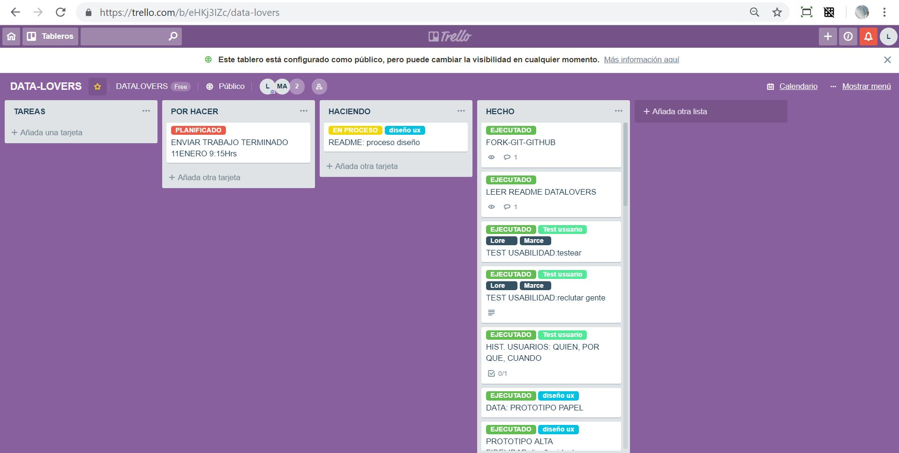
link: https://trello.com/b/eHKj3IZc/data-lovers

 

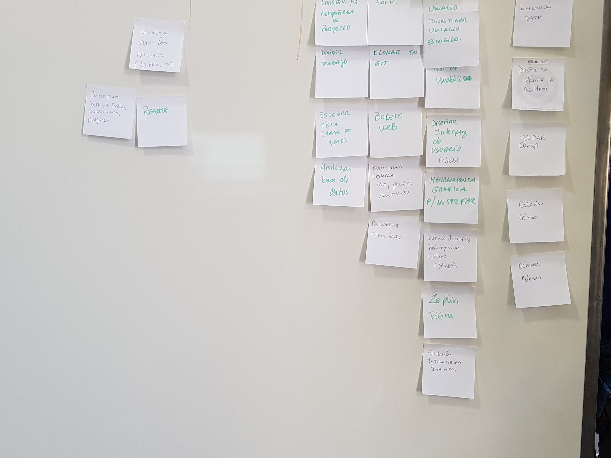

#### 5.2. HISTORIAS DE USUARIO

Aplicando la información obtenida mediante los testeos de usabilidad, se ha realizado la historia de usarios, habiéndose efectuado todas las modificaciones según las observaciones obtenidas y descritas en los criterios de aceptación.

**ENUNCIADO DE LA HISTORIA**
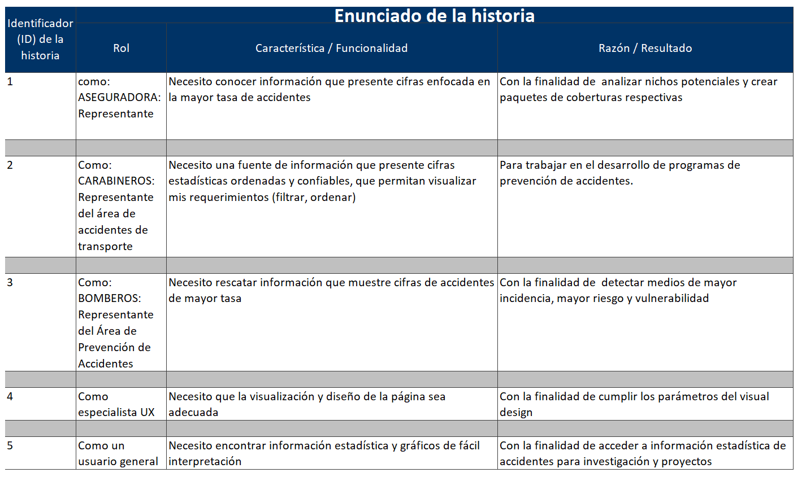

**CRITERIOS DE ACEPTACIÓN**
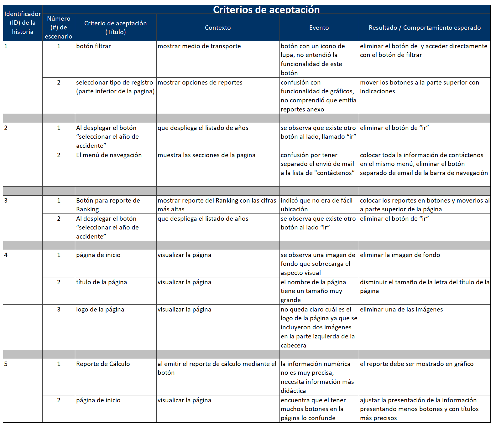

#### 5.3. DISEÑO DE LA INTERFAZ DE USUARIO

##### 5.3.1. PROTOTIPO DE BAJA FIDELIDAD
Se dibujó el prototipo de baja fidelidad, imagen siguiente:

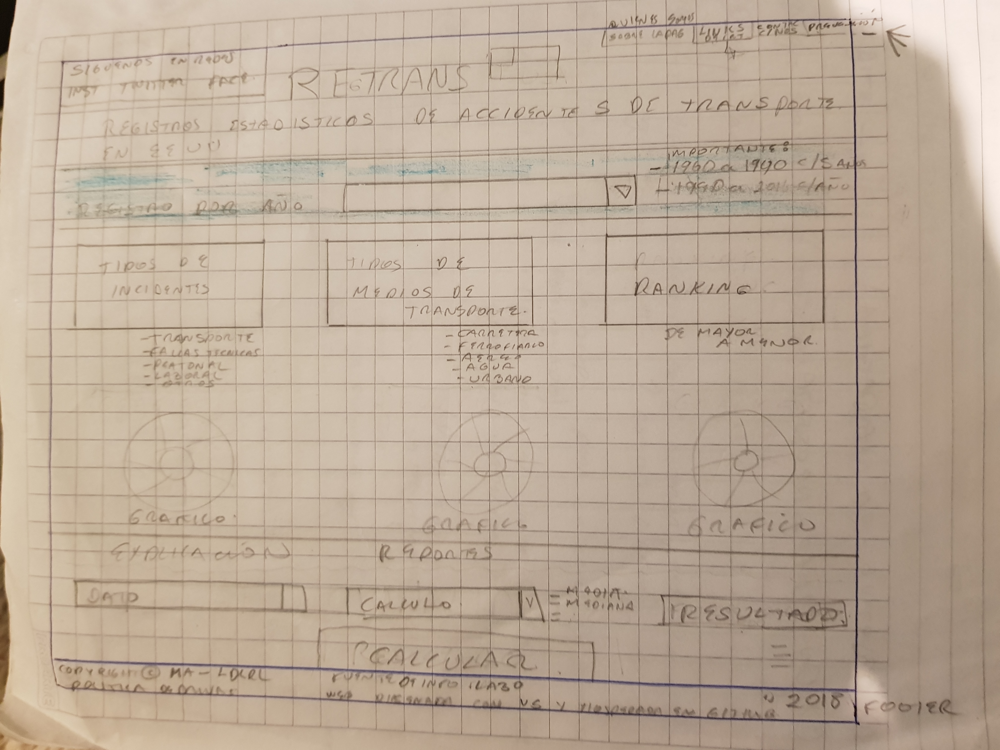

##### 5.3.2. PROTOTIPO DE ALTA FIDELIDAD
Se diseñó el prototipo de alta fidelidad, utilizando la herramienta gráfica "Photshop", misma que fue vinculada mediante plugin con la herramienta "Zeplin"

**PHOTOSHOP**

**PRIMER PROTOTIPO**

**PROTOTIPO FINAL**
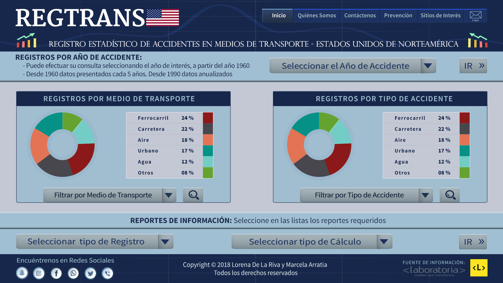

**ZEPLIN**

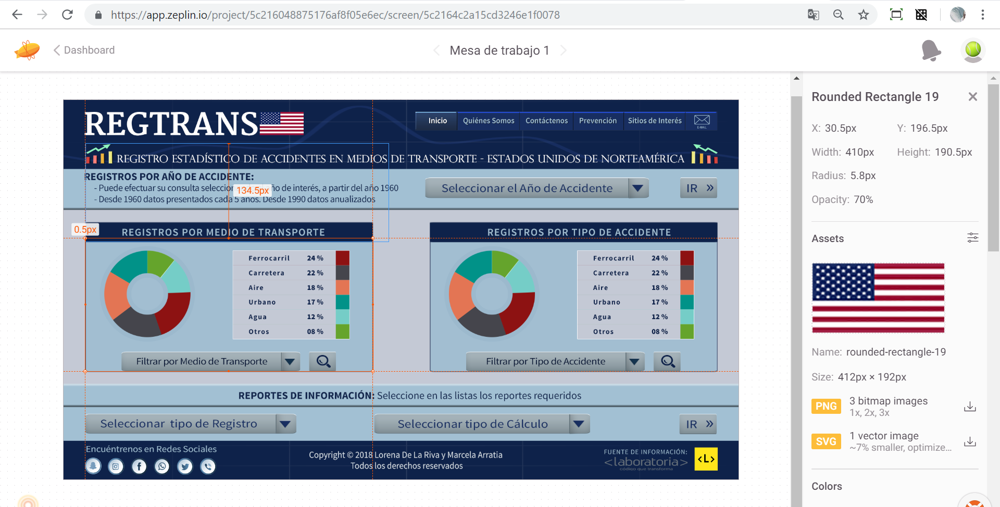

link Zeplin: https://zpl.io/scene/andEgxQ

##### 5.3.3. SIMULACIÓN DE INTERACTIVIDAD

Se diseñó el prototipo con animación para simulación de interactividad, utilizando la herramienta "Marvel"

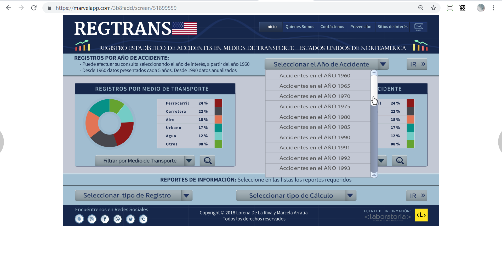

link Marvel: https://marvelapp.com/3b8fadd

##### 5.3.4. TESTEOS DE USABILIDAD
Sa han efectuado las entrevistas con usuarios objetivo representativos, en diferentes fases para la mejora del diseño. A continuación se presentan las tarjetas con la información obtenida, en una primera parte con las necesidades manifestadas y en una segunda parte con las observaciones realizadas a partir del prototipo de alta fidelidad y simulación de interactividad.

**USUARIO 1: CARABINEROS: REPRESENTANTE DEL AREA DE ACCIDENTES DE TRANSPORTE**

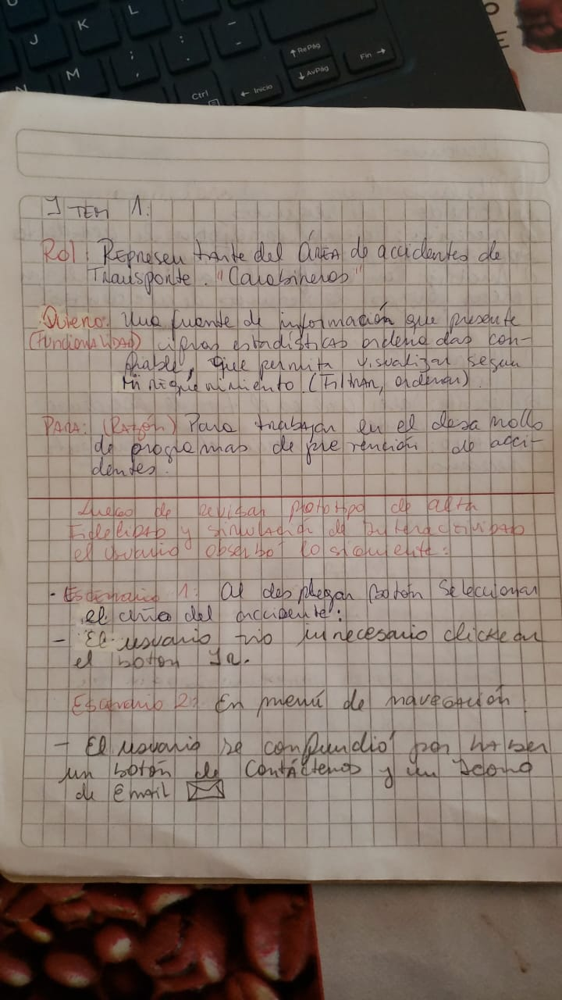

**USUARIO 2: REPRESENTANTE DE LAS ASEGURADORAS**

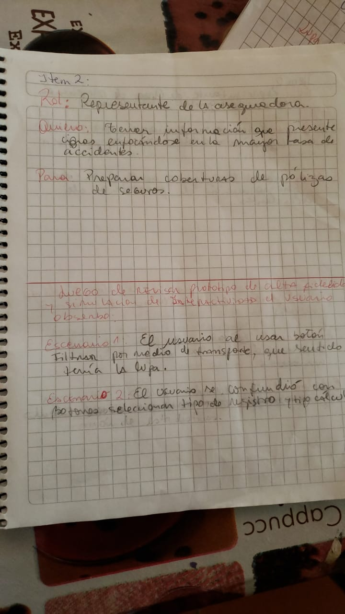

**USUARIO 3: BOMBREROS: REPRESENTANTE DEL AREA DE PREVENCIÓN DE ACCIDENTES**

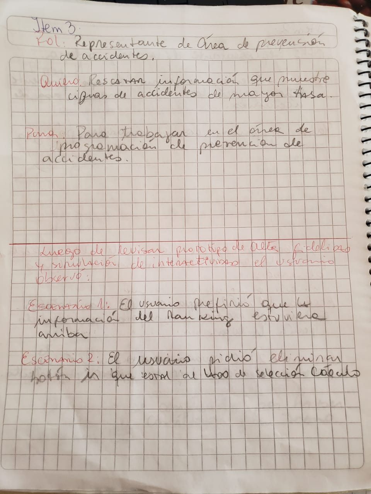

**USUARIO 4: ESPECIALISTA UX**

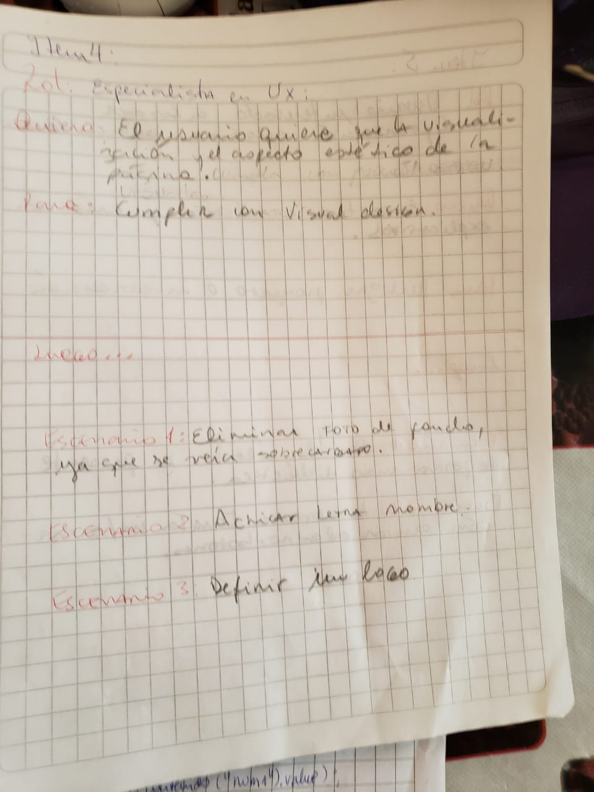

**USUARIO 5: USUARIO GENERAL**

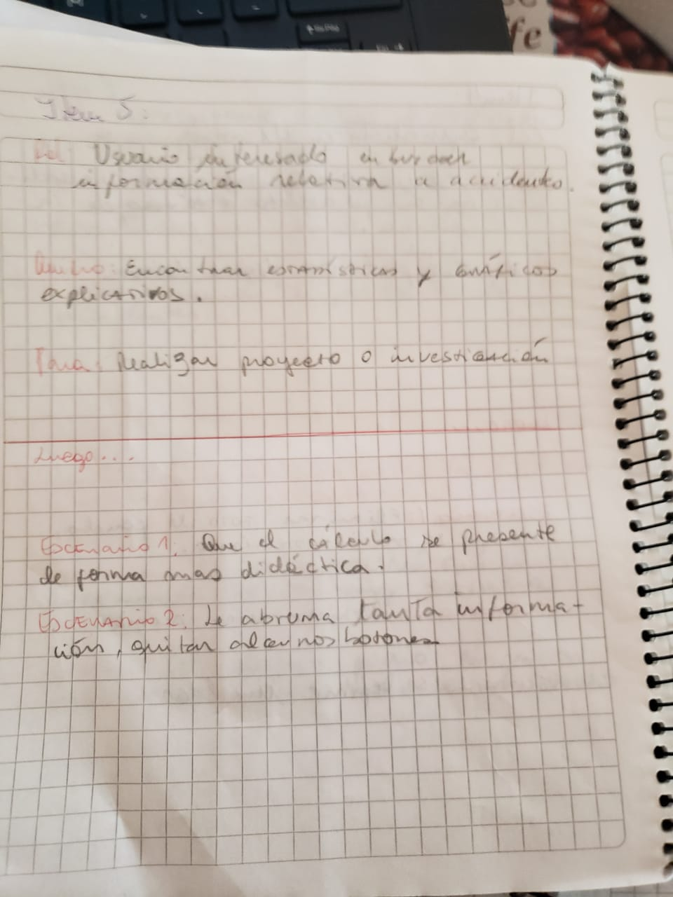

##### 5.3.5. PROCESO DE DISEÑO
Partiendo del esquema prototipo de alta fidelidad y analizando la historia de usuarios, se ha procedido al desarrollo y codificación de la página, teniendo en cuenta los siguientes aspectos:
* La impresión que debe generar la imagen del diseño, es confiabilidad y seriedad, por lo cual se eligierion colores sobrios (azul oscuro y celeste), y al mismo tiempo por tararse de información netamente numérica, se añadieron los gráficos con colores para que la imagen sea más amena y atractiva.
* Tipografía Serif, para resaltar los títulos. Tipografía sin Serif, para el contenido general de la página, a fin de permitir una fácil lectura.
* Se incluyeron listas desplegables para contener todas las opciones de selección, considerando se tiene información extensa.
* Se cuenta con la barra de navegación superior, para el fácil acceso a las secciones de la página, como a vínculos externos de interés.
* La ubicación de los gráficos ha sido asignada al centro de la página, para que sea de rápida visualización.
* Se cuenta con reportes de informacion, mediante el acceso de botones, los cuales son cargados en ventanas tipo modal.

#### 5.4. IMPLEMENTACIÓN DE LA INTERFAZ DE USUARIO

**INTERFAZ DE LA ESTRUCTURA EN HTML/CSS**
Se ha realizado la estructura según el prototipo de alta fidelidad. Según las historias de usuarios, se realizaron las modificaciones de los aspectos observados.
Se ha realizado el trabajo responsive utilizando código Boostrap y MediaQueries.
No se ha llegado a cumplir el prototipo en su totalidad, en razón del tiempo. Sin embargo, se ha cumplido toda la parte requerida más uno de los puntos del hacker edition.

##### 5.4.1. PRUEBAS UNITARIAS - TESTING

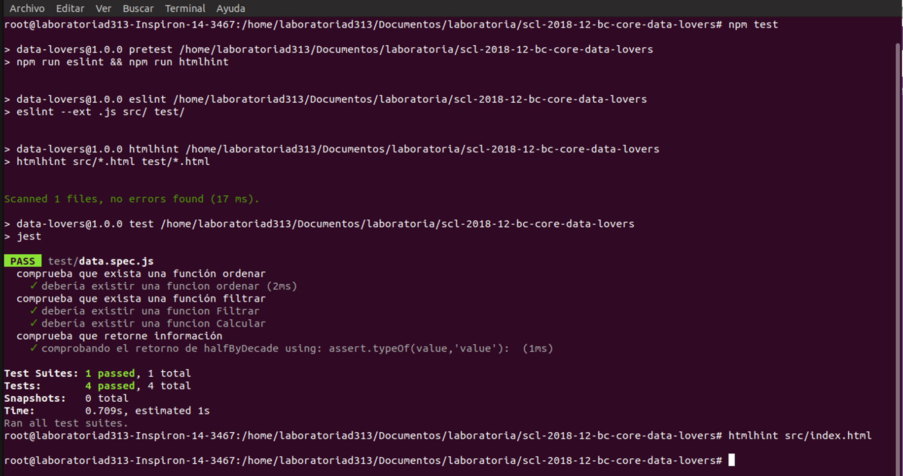

##### 5.4.2. HACKER EDITION
Se han añadido cuadros de gráficos, usando Google Chart.

##### 5.4.3. CHECK-LIST
Según el Check-List asignado en el documento README del proyecto DataLovers, los ítems se han cumplido en su totalidad, acorde a la verificación siguiente:

✓ Usa VanillaJS.

✓ No hace uso de this.
 
✓ Pasa linter (npm pretest)
 
✓ Pasa tests (npm test)
 
✓ Pruebas unitarias cubren un mínimo del 70% de statements, functions y lines y branches.
 
✓ Incluye Definición del producto clara e informativa en README

✓ Incluye historias de usuario en README
 
✓ Incluye sketch de la solución (prototipo de baja fidelidad) en README

✓ Incluye Diseño de la Interfaz de Usuario (prototipo de alta fidelidad) en README
 
✓ Incluye link a Zeplin en README
 
✓ Incluye el listado de problemas que detectaste a través de tests de usabilidad en el README
 
✓ UI: Muestra lista y/o tabla con datos y/o indicadores.
 
✓ UI: Permite ordenar data por uno o más campos (asc y desc).
 
✓ UI: Permite filtrar data en base a una condición.

#### 5.3. GUÍA RÁPIDA PARA USAR LA HERRAMIENTA

1. Ingresar a la dirección WEB.

2. Se carga la pantalla de inicio

 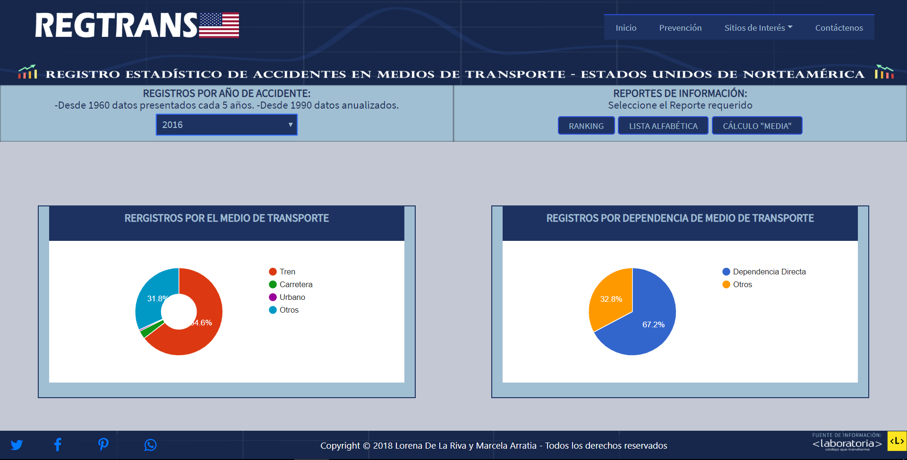

3. Se pueden observar las siguientes opciones de interacción:
* Menú de Navegación
    * Vínculo a Inicio, para redirigirse al inicio de la página
    * Prevención, sitio externo con información sobre prevención de accidentes
      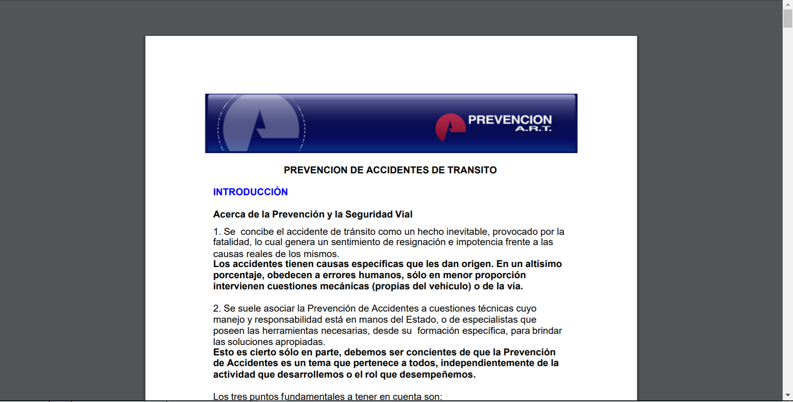

    * Sitios de Interés, con vínculos a la información descriptiva de la página y entidades (Bomberos, Carabineros, Aseguradoras)
    
      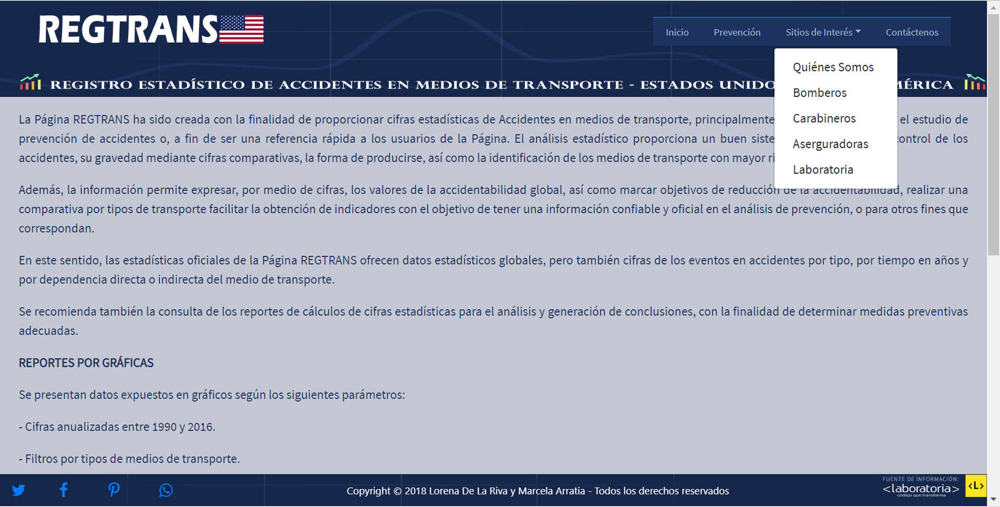

      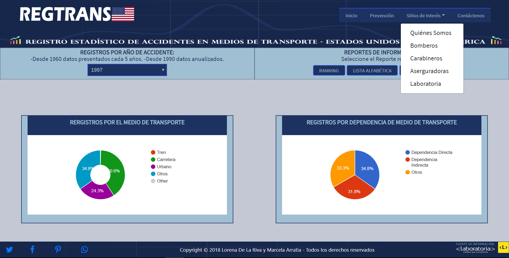

* Seleccionar Año, aquí se puede seleccionar el año que se quiere visualizar y se cargan dos gráficos con informacion estadística por medio de transporte y por dependencia directa o indirecta del accidente con los medios de tranporte.

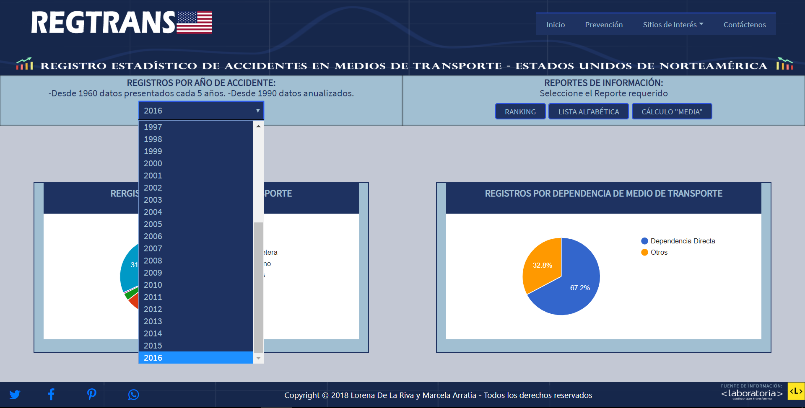

* Seleccionar el reporte, según el año elegido, carga 2 cuadros con gráficos   que muestran registros por tipos de medio de transporte y por depependencia del medio de transporte del año elegido. Adicionalmente, pueden obtenerse los siguientes reportes:

    * Ranking 10 con las cifras más altas registradas

     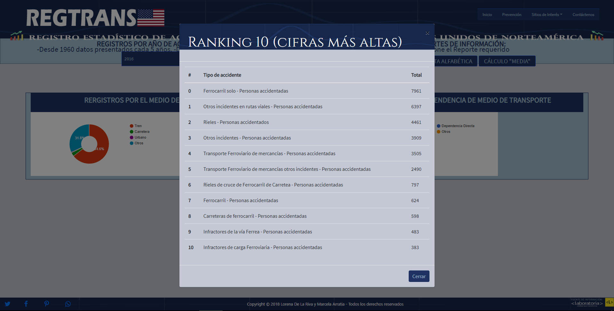

    * Listado Alfabético de todos los accidentes que se han considerado para emitir el reporte

    **ORDEN A - Z**

     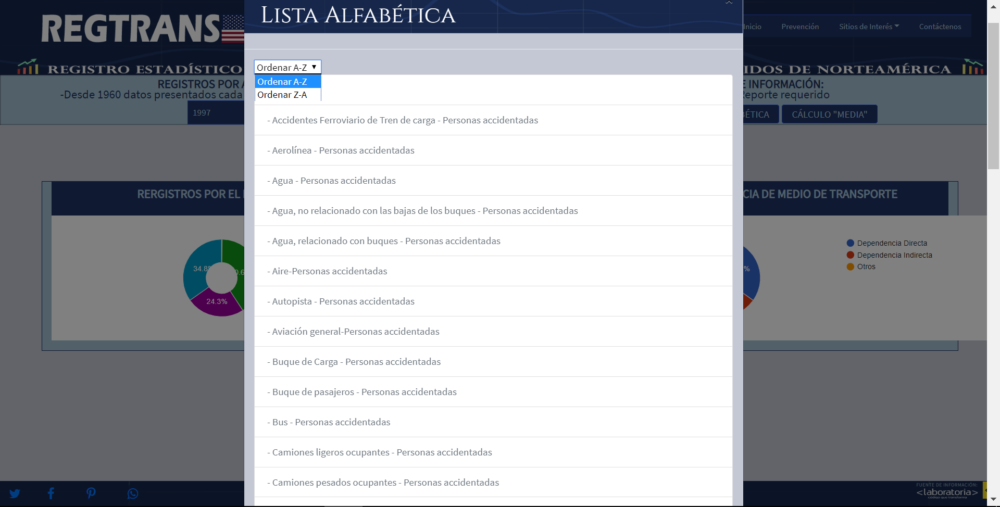

    **ORDEN Z - A**

     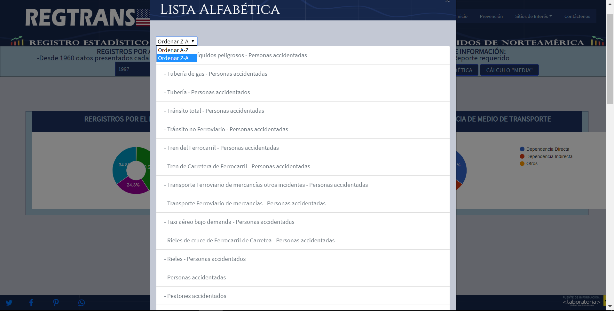

    * Cálculo de la Media aritmética presentada por decadas.

     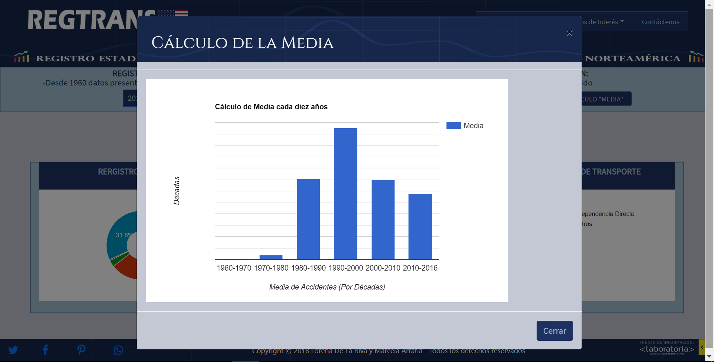

* Links a Redes Sociales
    * Facebook
    * Twitter
    * Pinterest
    * Whatsapp

3. Los Reportes generados por la página incluye lo siguiente:
 
    * **REPORTES POR GRÁFICAS**
      Se presentan datos expuestos en gráficos según los siguientes parámetros:

        * Cifras anualizadas entre 1990 y 2016.
        * Filtros por tipos de medios de transporte.
        * Filtros por dependencia directa o indirecta de los medios de transporte.

    * **REPORTES SIMPLES**
      Se presentan reportes en formato simple de los siguientes registros:

        * Listado general de los accidentes contenidos en la página, mismos que han sido considerados para efectuar los distintos  gráficos y cálculos, mencionados en el listado anterior.
        * Cálculo de la Media de las cifras de accidentes.
        * Ranking de los accidentes más frecuentes, mostrando las primeras diez cifras mayores. 
____________________

### 6. AUTORÍA

* Marcela Arratia  
* Lorena De La Riva Lens 

ESTUDIANTES LABORATORIA, 7ma. Generación. 
Santiago de Chile, enero de 2019. 

